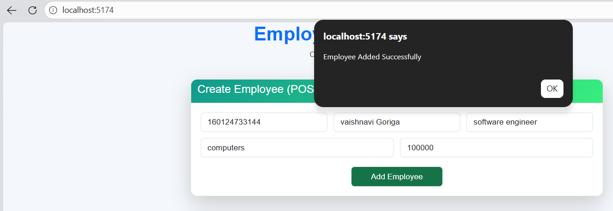
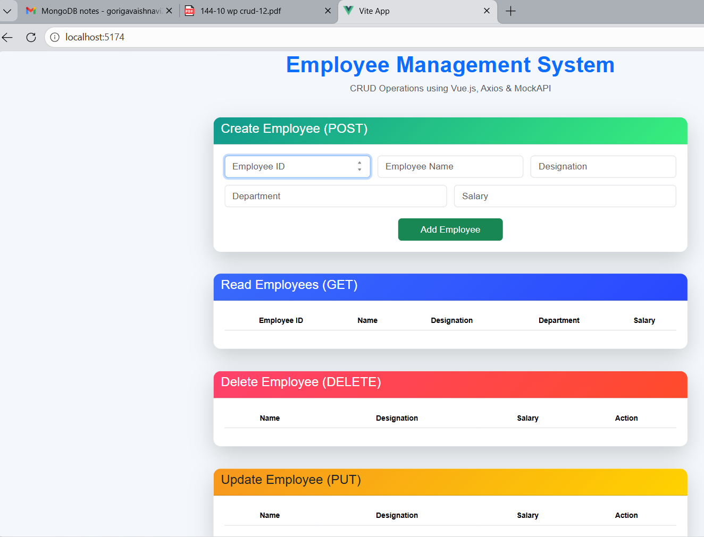
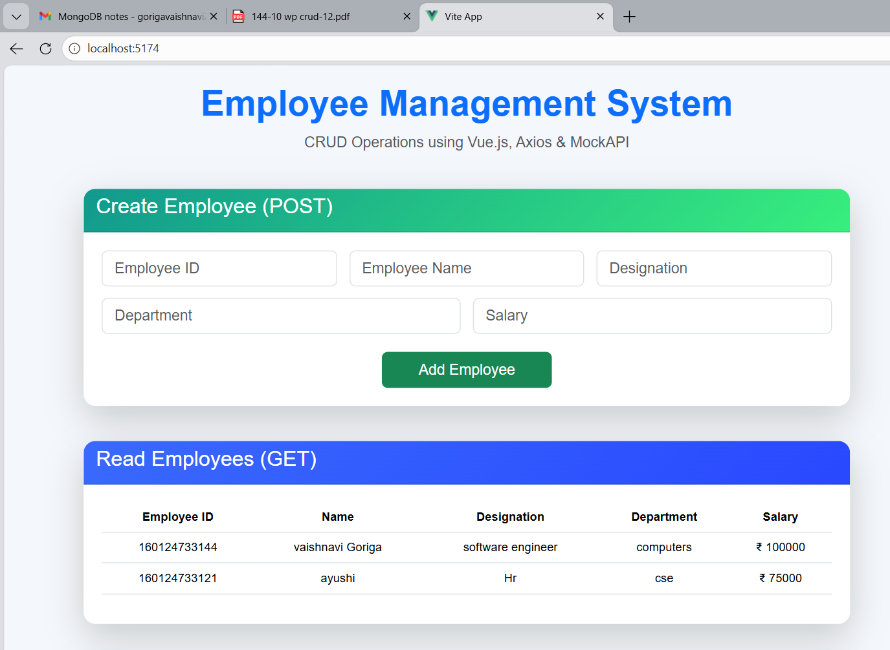
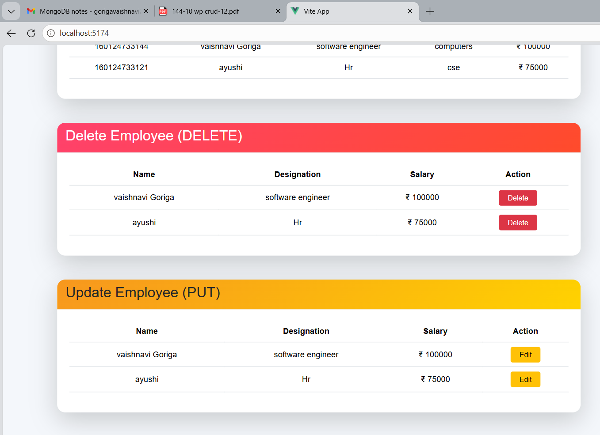
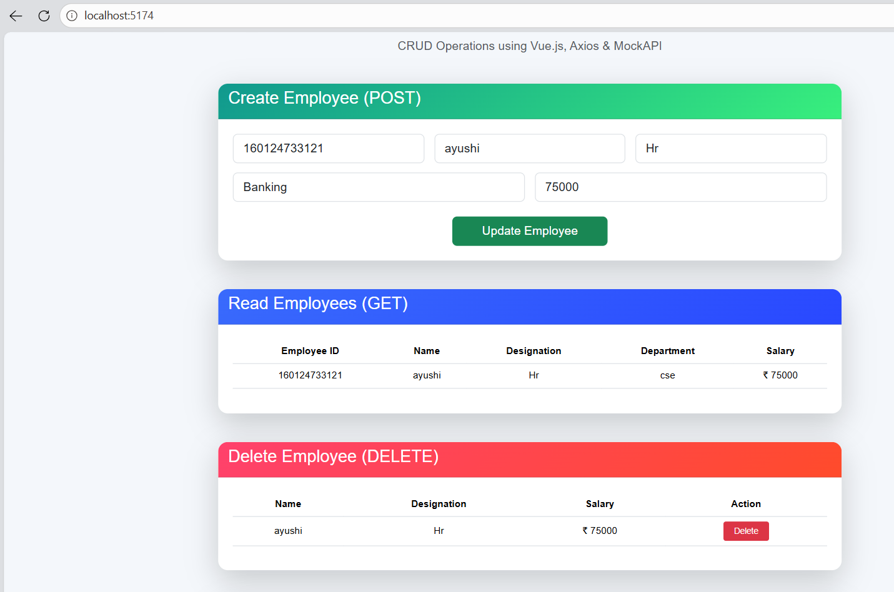
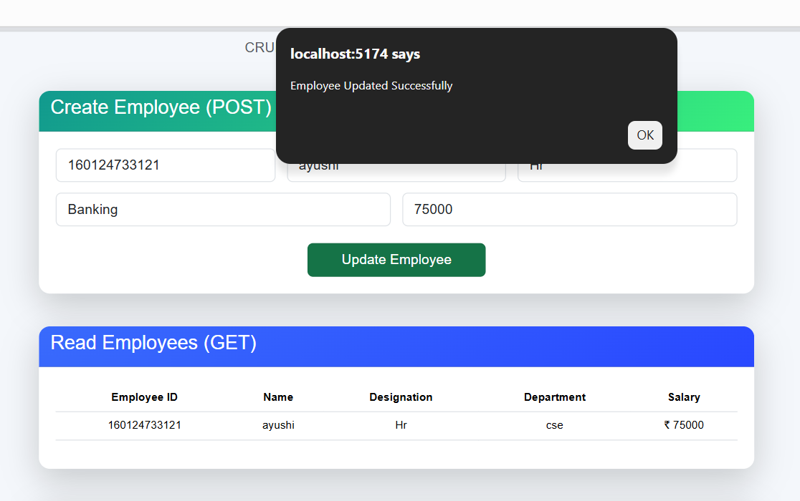
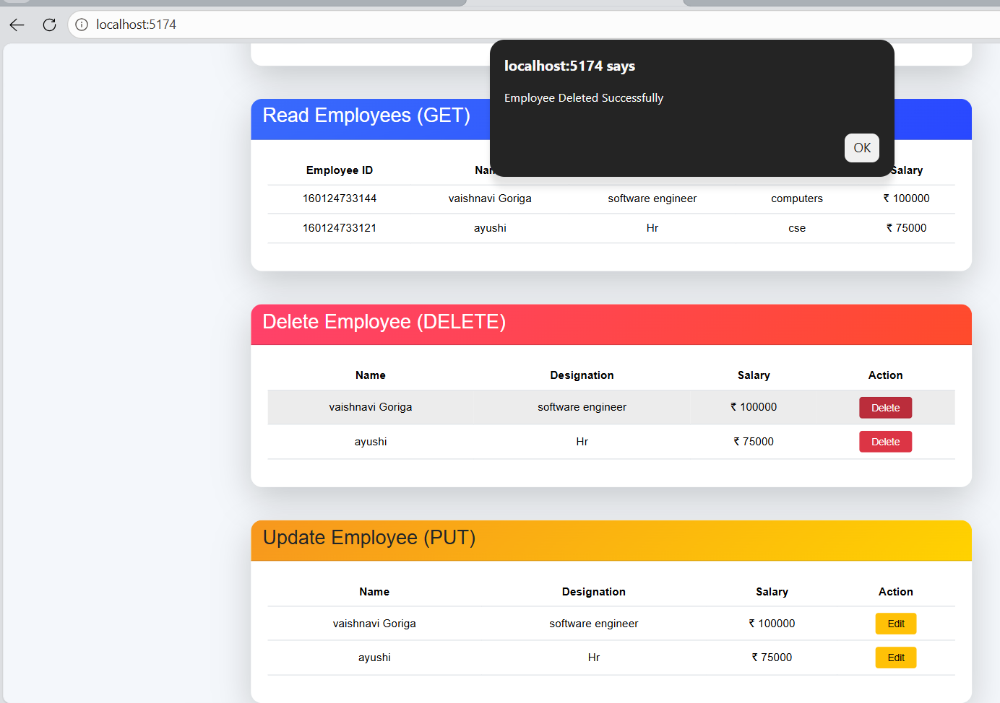
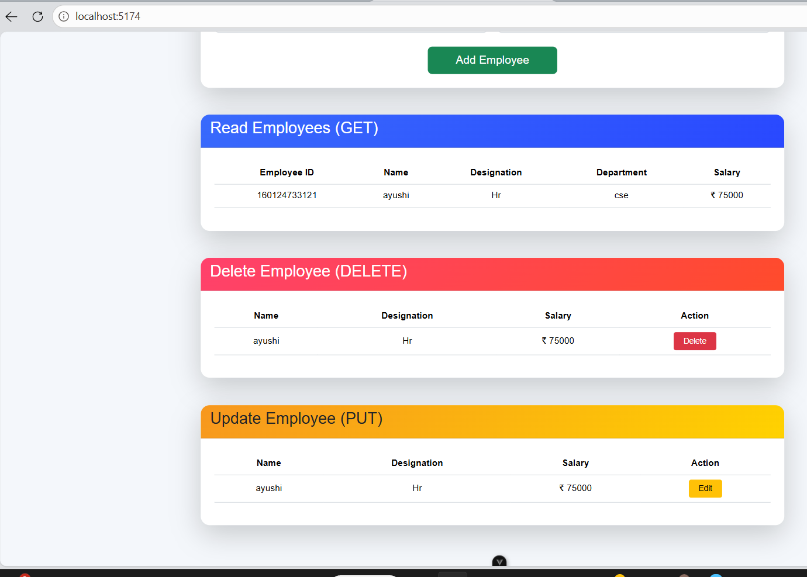

# Employee Management System

A responsive Employee Management Web Application built using Vue.js, Axios, MockAPI, and Bootstrap.

---

## Project Objective

This project performs CRUD operations on employee records:

- Create Employee
- Read Employee Details
- Update Employee Information
- Delete Employee Records

The application is connected to MockAPI as backend storage and designed with Bootstrap for responsive UI.

---

## Technologies Used

- Vue.js
- Axios
- MockAPI
- Bootstrap 5
- Vite
- GitHub Pages

---

## Employee Fields

- Employee ID
- Name
- Designation
- Department
- Salary

---

## Features

### 1. Create Employee (POST)

Users can add a new employee by entering:

- Employee ID
- Name
- Designation
- Department
- Salary

After clicking **Add Employee**, data is stored in MockAPI and reflected in the Read section.

### Screenshot



---

### 2. Read Employees (GET)

Displays all employee records fetched from MockAPI using Axios GET request.

### Default Page Before Adding Data



### Read Employee Records



---

### 3. Update Employee (PUT)

Users can update employee details.

**Process:**
1. Click Edit button
2. Existing data gets populated in form
3. Modify fields
4. Click Update Employee

### Update Section



### Updating Employee



### Updated Output



---

### 4. Delete Employee (DELETE)

Users can delete employee records from the system.

**Process:**
1. Click Delete button
2. Employee is removed from MockAPI
3. Read table refreshes automatically

### Delete Section



### After Deleting Record



---

## API Endpoint

```bash
https://69f5a000fb098eb7f0b56466.mockapi.io/api/employees
```

---

## Installation

Clone repository:

```bash
git clone https://github.com/vaishnavigoriga/employee-management-system.git
```

Install dependencies:

```bash
npm install
```

Run locally:

```bash
npm run dev
```

---

## Deployment

Project deployed using GitHub Pages.

Live Website:

```bash
https://vaishnavigoriga.github.io/employee-management-system/
```

---

## Folder Structure

```bash
employee-management-system/
│
├── src/
│   ├── components/
│   │   └── EmployeeForm.vue
│   ├── App.vue
│   └── main.js
│
├── screenshots/
│   ├── defaultpagebeforeadding.png
│   ├── create.png
│   ├── reademployees.png
│   ├── delete&updateoptions.png
│   ├── delete.png
│   ├── afterdeleting.png
│   ├── updating.png
│   └── updation.png
│
├── package.json
└── README.md
```

---

## Output

- Functional CRUD operations
- Responsive UI for all devices
- MockAPI Integration
- Bootstrap Styling
- GitHub Deployment

---

## Author

**Vaishnavi**
